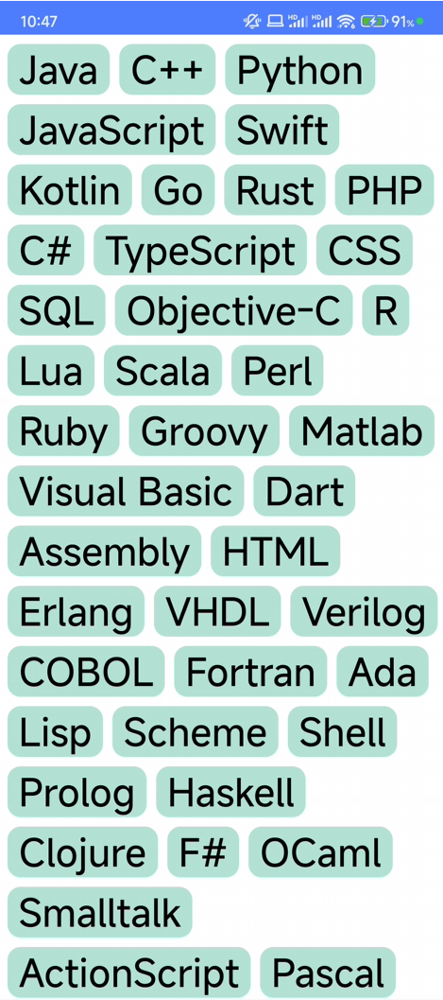

# Liuchangxu Android Works

## 今日作业0430-Kotlin 已上传

### 作业0430

1. 使用Kotlin实现滑动列表，支持点击查看详情大图和文案，包含下拉刷新功能
2. 拥有首页和我的页面功能
3. 列表有两种类型，分别是文本类型和图片类型
4. 两种类型均支持点击查看详情大图和文案，支持在详情中点赞，在首页和我的页面中同步点赞状态
5. 使用SwipeRefreshLayout实现下拉刷新功能

#### 演示视频见[此处](demo/work_0430/作业演示视频0430.mp4)

#### 代码见[此处](app/src/main/java/com/example/work_liuchangxu/work_0430)

## 往日作业

### 作业0429

1. 涉及到 Handler 的，使用 Static 静态内部类+WeakReference 优化调用方式，知道 onDestroy 反注册、清空callback操作的
2. 网络部分，如果用到 Thread 或者其他耗时操作，知道使用静态内部类改造，如果不涉及，就新写一个Thread案例，在runnable中做具体的网络操作，并处理内存泄露
3. 写出相关优化方案，能达到提升监控ANR准确率的目的

#### 内存泄漏优化内容、ANR优化方案见[此处](demo/work_0429/README.md)

#### ANR作业演示视频见[此处](demo/work_0429/作业演示视频0429.mp4)

#### 内存泄漏优化代码见[此处](app/src/main/java/com/example/work_liuchangxu/work_0429/Fragment_main_0429_2.java)

#### ANR优化代码见[此处](app/src/main/java/com/example/work_liuchangxu/work_0429/MyANRWatchDog.java)

### 作业0428

1. 使用Handler实现短信验证码60s倒计时功能
2. 完成搜索功能，将搜索结果使用列表展示，支持页面下拉刷新和上拉加载更多；使用OkHttp和Retrofit两种方式进行网络请求

#### 演示视频见[此处](demo/work_0428/作业演示视频0428.mp4)

#### 代码见[此处](app/src/main/java/com/example/work_liuchangxu/work_0428)

### 作业0427

1. 完成“云标签”控件，包括自定义属性
2. 完成拖动手势
3. 完成拖动手势后，触发标签变更位置

#### 演示视频见[此处](demo/work_0427/作业演示视频0427.mp4)

#### 代码见[此处](app/src/main/java/com/example/work_liuchangxu/work_0427)

### 作业0426

1. 使用补间动画，基于当前 View中心点放大1.5倍，同时逆时针旋转720度，由不透明变为透明度。.8，持续2000ms，并且重复动画3次。(要求:任选XML或Java方式实现，动画开始时打印日志“animationstart”，动画重复时打印”animationrepeat”以及重复了2次，动画结束时打印日志"animationend”)
2. 实现属性动画，使用AnimatorSet，先是当前View围绕x轴旋转360度，持续1000ms;然后向右移动120px，持续100oms;最后从不透明变成透明度0.5，持续500ms。(要求:使用Java方式实现，需要有2个基础动画同时执行，有1个顺序执行，且实现至少2种不同效果的自定义插值器与估值器)

#### 演示视频见[此处](demo/work_0426/作业演示视频0426.mp4)

#### 代码见[此处](app/src/main/java/com/example/work_liuchangxu/work_0426)

### 作业0425

1. 运用ViewPager实现左右滑动、RecycleView实现滑动列表
2. 支持点击查看详情大图和文案，支持在详情中点赞
3. 包含下拉刷新功能
4. 包含上划加载功能 使用多线程异步模拟数据加载

#### 演示视频见[此处](demo/work_0425/作业演示视频0425.mp4)

#### 代码见[此处](app/src/main/java/com/example/work_liuchangxu/work_0425)

### 作业0424

1. 实现一个UI
2. 查看过度绘制
3. 实现图片src与文本的**动态加载**

#### 演示视频见[此处](demo/work_0424/作业演示视频0424.mp4)

#### 代码见[此处](app/src/main/java/com/example/work_liuchangxu/work_0423)

### 作业0423

1. 实现一个列表，要求具有点击事件，item样式需包含文字图片
2. 实现增加删除列表项功能

#### 演示视频见[此处](demo/work_0423/作业演示视频0423.mp4)

#### 代码见[此处](app/src/main/java/com/example/work_liuchangxu/work_0423)

### 作业0422

1. 搭建App首页，一个Activity 有多个fragment，点击底部fragment切换fragment，Fragment只显示一个文本即可
2. 使用ViewPager实现Fragment左右滑动

#### 演示视频见[此处](demo/work_0422/作业演示视频0422.mp4)

#### 代码见[此处](app/src/main/java/com/example/work_liuchangxu/work_0422)

### 作业0421

#### 生成apk文件见[此处](demo/work_0421)
