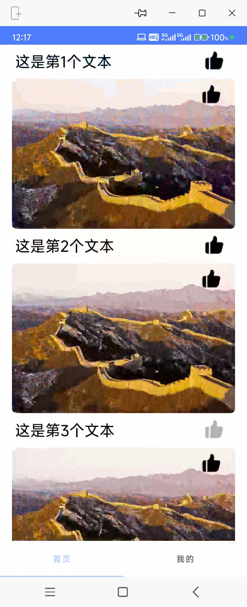
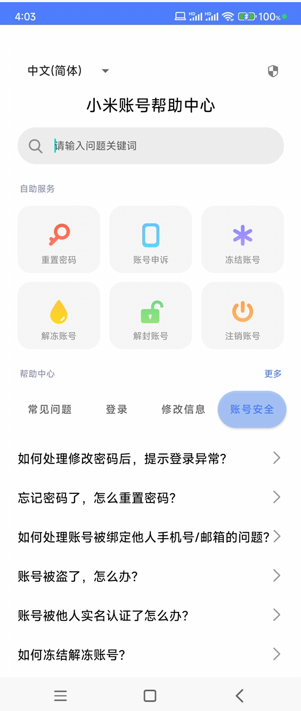

# Liuchangxu Android Works

## 今日作业0426-Animate已上传

### 作业0426

1. 使用补间动画，基于当前 View中心点放大1.5倍，同时逆时针旋转720度，由不透明变为透明度。.8，持续2000ms，并且重复动画3次。(要求:任选XML或Java方式实现，动画开始时打印日志“animationstart”，动画重复时打印”animationrepeat”以及重复了2次，动画结束时打印日志"animationend”)
2. 实现属性动画，使用AnimatorSet，先是当前View围绕x轴旋转360度，持续1000ms;然后向右移动120px，持续100oms;最后从不透明变成透明度0.5，持续500ms。(要求:使用Java方式实现，需要有2个基础动画同时执行，有1个顺序执行，且实现至少2种不同效果的自定义插值器与估值器)

## 往日作业

### 作业0425

1. 运用ViewPager实现左右滑动、RecycleView实现滑动列表
2. 支持点击查看详情大图和文案，支持在详情中点赞
3. 包含下拉刷新功能
4. 包含上划加载功能 使用多线程异步模拟数据加载

演示视频见[此处](demo/work_0425/作业演示视频0425.mp4)

代码见[此处](app/src/main/java/com/example/work_liuchangxu/work_0425)

### 作业0424

1. 实现一个UI
2. 查看过度绘制
3. 实现图片src与文本的**动态加载**

演示视频见[此处](demo/work_0424/作业演示视频0424.mp4)

代码见[此处](app/src/main/java/com/example/work_liuchangxu/work_0423)

### 作业0423

1. 实现一个列表，要求具有点击事件，item样式需包含文字图片
2. 实现增加删除列表项功能

演示视频见[此处](demo/work_0423/作业演示视频0423.mp4)

代码见[此处](app/src/main/java/com/example/work_liuchangxu/work_0423)

### 作业0422

1. 搭建App首页，一个Activity 有多个fragment，点击底部fragment切换fragment，Fragment只显示一个文本即可
2. 使用ViewPager实现Fragment左右滑动

演示视频见[此处](demo/work_0422/作业演示视频0422.mp4)

代码见[此处](app/src/main/java/com/example/work_liuchangxu/work_0422)

### 作业0421

生成apk文件见[此处](demo/work_0421)
