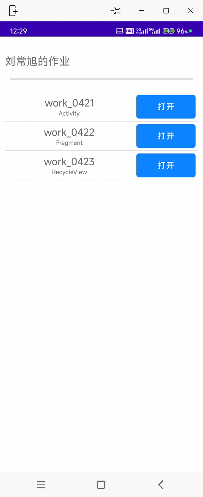

# Xiaomi Android Works

## 启动APP后，可以看到以下界面：

## 点击某一天作业的“启动”按钮即可跳转到当天作业APP

## 作业0423已上传
```
1. 实现一个列表，要求具有点击事件，item样式需包含文字图片
2. 实现增加删除列表项功能
```
### 演示视频见[此处](demo/work_0423/作业演示视频0423.mp4)
### 代码见[此处](app/src/main/java/com/example/work/work_0423)

# 往日作业

## 作业0422
```
1. 搭建App首页，一个Activity 有多个fragment，点击底部fragment切换fragment，Fragment只显示一个文本即可
2. 使用ViewPager实现Fragment左右滑动
```
### 演示视频见[此处](demo/work_0422/作业演示视频0422.mp4)
### 代码见[此处](app/src/main/java/com/example/work/work_0422)

## 作业0421

### 生成apk文件见[此处](demo/work_0421)